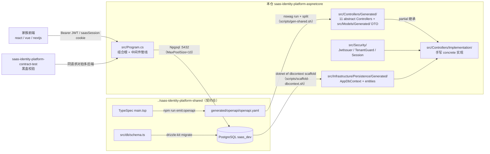
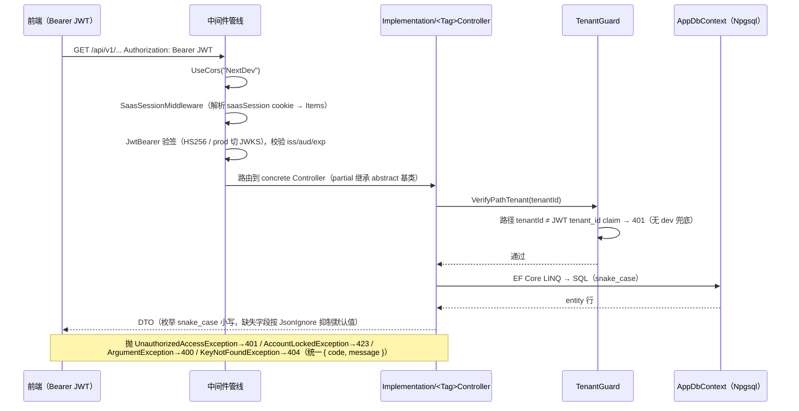

# saas-identity-platform-aspnetcore 架构

> 一句话定位：`saas-identity-platform` 多仓家族的 ASP.NET Core 8 后端实现——消费 shared 契约仓的 OpenAPI 产物生成 abstract Controllers + DTO，手写 partial 承接业务逻辑，与 springboot / nextjs / msw 同位实现同一份产品契约，供三个前端（react/vue/nextjs）与 contract-test 仓黑盒调用。

生成日期：2026-09-22 ｜ 锚定 HEAD：7fb2ee4 ｜ 生成方式：DeepWiki 风格架构扫描

## 1. 总览

- **家族角色**：后端仓（6 角色中的「后端」）。产品契约（TypeSpec + Drizzle schema）的真源在 `../saas-identity-platform-shared`（schema-first 双 SSOT 仓）；本仓不做契约演进，只消费生成物并对齐行为——contract-test 仓对全家族后端做黑盒校验，要求「前端不可区分」。
- **技术栈**（版本钉死于 `version-lock.json`）：.NET 8（net8.0）、ASP.NET Core 8、EF Core 8 + Npgsql 8（PostgreSQL，DB-First scaffold）、JwtBearer 8.0.0、Swashbuckle 6.6.2（Swagger UI）、NSwag 14.7.1 codegen、xUnit 2.9.0 + Moq 4.20.70。
- **规模速览**（不含 `obj/`/`bin/`）：`src/` + `tests/` 共 114 个 `.cs` 文件、约 8.9k 行；NSwag 生成 11 个 abstract Controller、58 个 abstract 端点方法、约 47 个 DTO 文件；手写实现 13 个文件（11 个 concrete Controller + `AuthApi.cs` / `StatusEnumMaps.cs` / `MembershipViews.cs`）；scaffold 出 10 个 entity + `AppDbContext`；测试 60 个 Fact/Theory 方法。

端点分组概览（路由前缀全部 `api/v1`，58 个方法从 `src/Controllers/Generated/` 的 `Route(...)` 实测提取）：

| tag / 生成基类 | 路由前缀 | 职责 | 方法数 |
|---|---|---|---|
| `TenantMembersController` | `/tenants/{tenantId}/members...` | 成员、邀请、成员角色/状态 | 9 |
| `AdminClientsController` | `/admin/clients...` | OAuth client 管理（含 status） | 7 |
| `ClientMenusController` | `/clients/{clientId}/menus...` | client 菜单 CRUD + parent/reorder | 8 |
| `TenantRolesController` | `/tenants/{tenantId}/roles...` | 租户角色 CRUD | 6 |
| `AdminTenantsController` | `/admin/tenants...` | 租户管理 | 6 |
| `MeController` | `/me...` | 当前用户、菜单、租户列表/切换 | 5 |
| `TenantApplicationsController` | `/tenants/{tenantId}/applications...` | 租户应用订阅 | 5 |
| `TenantRoleMenusController` | `/tenants/{tenantId}/roles/{roleId}/menus` | 角色-菜单授权 | 4 |
| `AuthController` | `/auth/login`、`/auth/logout` | 密码登录 + session | 3 |
| `OauthController` | `/oauth/authorize`、`/oauth/token` | 授权码签发 + 令牌交换/刷新 | 3 |
| `ClientsController` | `/clients/{clientId}` | client 公开信息 | 2 |

## 2. 系统架构

关键边界：本仓对 shared 只有两条单向依赖通道——`scripts/gen-shared.sh` 读 `generated/openapi/openapi.yaml` 生成 Controllers/DTO（NSwag 不把 shared 列为依赖，直接读相对路径）；`scripts/scaffold-dbcontext.sh` 从真库 scaffold 出 `AppDbContext` + entity（ADR-0025 DB-First，schema 由 shared 统一管，本仓禁止 EF Migrations）。生成物与手写实现严格分层：`Generated/` 目录禁手改，业务逻辑全部落在 `src/Controllers/Implementation/` 的 partial concrete 类里。

## 3. 模块分解

| 模块/目录 | 职责 | 关键文件 |
|---|---|---|
| `src/Program.cs` | 组合根：DI 注册、JwtBearer、CORS、中间件管线、错误语义映射、枚举 snake_case 序列化、MalformedBodyFilter / ModelStateValidationFilter | `src/Program.cs`（468 行） |
| `src/Controllers/Generated/` | NSwag 产物，11 个 abstract ControllerBase（按 OpenAPI tag 拆分），禁手改 | `AuthController.cs`、`OauthController.cs`、`MeController.cs` 等 11 个 |
| `src/Controllers/Implementation/` | 手写 partial concrete 实现，承接全部业务逻辑 | `OAuthController.cs`、`AuthApi.cs`、`MeController.cs`、`TenantMembersController.cs` 等 13 个 |
| `src/Models/Generated/` | NSwag 生成的 DTO record（每类一文件） | `LoginResponse.cs`、`OAuthClient.cs`、`TenantMember.cs` 等 |
| `src/Security/` | 鉴权与会话基建：JWT 签发、租户校验、session 三件套、失败锁定 | `JwtIssuer.cs`、`TenantGuard.cs`、`TenantContext.cs`、`SaasSessionMiddleware.cs`、`SaasSessionStore.cs`、`FailedLoginStore.cs` |
| `src/Infrastructure/Persistence/Generated/` | EF scaffold 产物：`AppDbContext` + 10 个 entity（snake_case 命名），禁手写、禁手改 | `AppDbContext.cs`、`SysUser.cs`、`OauthClient.cs`、`OauthCode.cs` 等 |
| `src/Infrastructure/Audit/` | 审计写入助手（v0.5.0 起 M06 表已 DROP，实现为 no-op，接口保留防 DI 破） | `AuditWriter.cs` |
| `src/Hosting/` | `SERVER_PORT` → UseUrls 适配（家族统一监听 key，本仓 5104） | `ServerPortShim.cs` |
| `scripts/` | 双向生成流水线 + trace | `gen-shared.sh`、`scaffold-dbcontext.sh`、`split-nswag-output.py`、`gen-trace.py` |
| `tests/` | xUnit 单测（含 `Harness/FnAttribute.cs` 供 trace） | `TenantGuardTests.cs`、`Auth/Session/*`、`ModelStateValidationTests.cs` 等 |
| `deploy/` | VPS 部署脚本 + nginx 配置样例 | `saas-identity-platform-aspnetcore.sh`、`setup-vps.sh`、`nginx-vps.conf.example` |

## 4. 数据流 / 请求生命周期

代表性链路：一次带鉴权的 tenant-scoped 请求（以「切换当前租户」`POST /api/v1/me/tenants/{tenantId}/switch` 一类端点为例）。

写入路径上，业务逻辑前强制调 `TenantGuard.VerifyPathTenant`（CLAUDE.md 铁律）；登录失败走 `FailedLoginStore`（5 次 / 15 分钟进程内计数）触发 `AccountLockedException`，按 shared 契约 `LockedAccountResponse` 形状返回。

## 5. 依赖面

- **对 shared 契约仓**：`scripts/gen-shared.sh` 先在 shared 仓跑 `npm run emit:openapi`，再 `nswag run aspnetcore.nswag` 读 `../saas-identity-platform-shared/generated/openapi/openapi.yaml` 产单文件 `AllGenerated.cs`，注入 `[JsonIgnore(WhenWritingDefault)]`（`parentId` / `expiresAt` / `currentTenantId` 三个默认值抑制项，ADR-0032），最后 `split-nswag-output.py` 按类拆为 11 Controller + 47 DTO；落 `.state/last-gen-shared.json` marker（ADR-0026，同 sha 零写入）供 suite staleness check。DB 侧：shared `db:migrate` 后跑 `scaffold-dbcontext.sh` 重生 `AppDbContext`。本仓**不把 shared 列为包依赖**（铁律：NSwag 直接读相对路径）。
- **对家族其他仓**（同位实现，行为对齐是硬要求）：

  | 仓 | 关系 | 对齐点 |
  |---|---|---|
  | `saas-identity-platform-shared` | 上游契约真源 | openapi.yaml 产物 + drizzle schema（双 SSOT） |
  | `saas-identity-platform-springboot` | 同位后端 | 同 env key（Phase 4 flat 对称化）、同错误语义、同分页约定 |
  | `saas-identity-platform-nextjs` / `saas-identity-platform-msw` | 同位后端 / mock | 共享 `JWT_SIGNING_KEY` 互签互验；session cookie 语义一致 |
  | `saas-identity-platform-contract-test` | 黑盒验收方 | 同请求对拍多后端，normalize 后要求 JSON 等价（「前端不可区分」） |
  | `saas-identity-platform-react` / `-vue` / `-nextjs` | 下游消费者 | 只认契约生成物 SDK，不感知本仓存在 |

  具体机制：全家族共用同一 `JWT_SIGNING_KEY`（跨仓 token 互认）；`SERVER_PORT=5104` 遵循家族端口分段约定（suite `multi-repo-family.md §6`）；Npgsql 连接池显式压到 MaxPoolSize=10，避免 contract-test 并发跑批打满共享 PG 的 max_connections（多后端共库是「前端不可区分」的物理基础）。
- **外部依赖**：PostgreSQL（`DATABASE_URL`，全家族统一 key）；prod IdP 切换靠 `JWT_AUTHORITY`（issuer-uri，JwtBearer 自动走 JWKS）；dev/staging 的 HS256 本地验签不依赖外部 IdP（v0.2.1 起 dev `alg=none` 分支已删，统一真验签，与 JwtIssuer 共享同一 key）。

## 6. 配置与部署

env 变量表（读点均在 `src/Program.cs` / `src/Security/JwtIssuer.cs`）：

| key | 用途 | 缺失时行为 |
|---|---|---|
| `DATABASE_URL` | PG 连接串（全家族统一 key） | fallback 到 `ConnectionStrings:Postgres`（appsettings.json）；两者皆缺则 Npgsql 建连失败 |
| `JWT_SIGNING_KEY` | HS256 签名/验签密钥（≥32B，RFC 7518） | fail-fast：启动即抛 InvalidOperationException（ADR-0019，无默认值兜底） |
| `JWT_ISSUER` / `JWT_AUDIENCE` | token 校验的 iss/aud | TokenValidationParameters 中为 null → 校验放行该维度（隐式宽松，待补充显式 fail-fast 证据） |
| `JWT_AUTHORITY` | prod issuer-uri，JwtBearer 切 JWKS | 未配则继续走 HS256 对称密钥路径 |
| `SAAS_CORS_ALLOWED_ORIGINS` | 跨源白名单（逗号分隔） | fail-fast：缺失抛 InvalidOperationException，禁 localhost 兜底（ADR-0019） |
| `SERVER_PORT` | 裸机监听端口（本仓 5104） | shim 返回 null 不干预；容器内由 `ASPNETCORE_URLS=http://+:5104` 接管 |
| `ASPNETCORE_URLS` | 容器监听地址（Dockerfile ENV） | 未设时由 SERVER_PORT shim 补 |

- **本地运行**：`dotnet run --project src`（appsettings*.json 在仓根，csproj 显式 Include 拷入 bin，ContentRoot 锚定 `AppContext.BaseDirectory`）；`/health` 与 `/swagger`（v0.1.5 暂全开）在线暴露。
- **镜像**：`Dockerfile` 多阶段（sdk:8.0 build → aspnet:8.0 runtime），非 root 用户 `saasasp`，监听 :5104，HEALTHCHECK 打 `/health`。
- **部署**：`deploy/saas-identity-platform-aspnetcore.sh` 在 VPS 自举 `aspnetcore.env`（DATABASE_URL / JWT_SIGNING_KEY 必填，缺即报错；非 secret 走已知 prod 字面量），nginx 反代 `saas-aspnetcore.xiangru.uk`；`setup-vps.sh` 与 `nginx-vps.conf.example` 配套。本仓为 suite 下的 submodule，版本放行走 tag（`v<MAJOR>.<MINOR>.<PATCH>-<YYYYMMDD>`）。

## 7. 质量门禁

来自 `.harness/stack.json`（suite 侧执行 `python scripts/gate.py -p saas-identity-platform-aspnetcore`）：

| 门 | 名称 | 命令 |
|---|---|---|
| L1 | 格式 | `dotnet format src/Saas.Identity.AspNetCore.csproj --verify-no-changes --include src/**` |
| L2 | 静态检查 | `dotnet build src/Saas.Identity.AspNetCore.csproj /p:TreatWarningsAsErrors=true` |
| L3 | 编译 | `dotnet build src/Saas.Identity.AspNetCore.csproj --no-restore` |
| L4 | 测试 | `dotnet test tests/Saas.Identity.AspNetCore.Tests.csproj --no-build` |
| L4.db.scaffold | DB schema 漂移 | `bash scripts/scaffold-dbcontext.sh`（可 `CI_DB_SCAFFOLD_SKIP=1` 跳过） |

另有 `trace_cmd: python scripts/gen-trace.py`（`TRACE_MAP=1`）跑 dotnet test 并产出 `.state/trace.json` 功能 ID 账本。exit code 语义：0 = 过；1 = 按修复提示回代码；2 = 契约/环境问题，停下问人。

日常循环（`CLAUDE.md §6`）：改业务只动 `src/Controllers/Implementation/` 的 partial concrete 类 → 跑门禁按 exit code 行动 → `/handoff` 更新 `.state/session.json`。改了 shared API 必须先 `bash scripts/gen-shared.sh` 再进门；DB schema 漂移则确认 shared 已 `db:migrate` 后 `bash scripts/scaffold-dbcontext.sh && git add src/Infrastructure/Persistence/Generated/ && git commit`。其他铁律（`CLAUDE.md §2`）：

- TDD：先写失败测试确认红 → 实现 → 确认绿 → commit
- 依赖版本钉死 `version-lock.json`，不引入 lock 外的库；tag 即放行（`v<M>.<m>.
-<YYYYMMDD>`）
- 禁止手写 Controller 路由（路由必须由 NSwag 生成）；禁止直接编辑 NSwag 产物 / scaffold 产物
- 禁止手写 DbContext / entity（ADR-0025 D7）；禁止 EF Migrations（schema 由 shared 统一管）
- 业务逻辑前强制 `TenantGuard.VerifyPathTenant(tenantId)`；禁止 env 默认值兜底（fail-fast）
- 决策记录在 `docs/adr/`（现存 ADR-0013、ADR-0014），细则在 `docs/conventions/`
